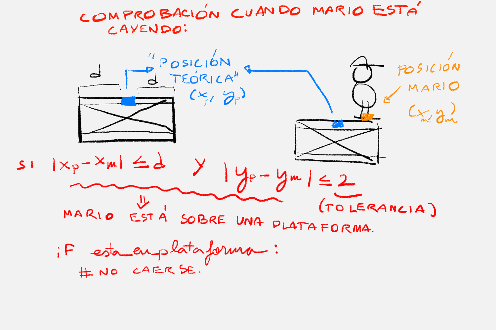
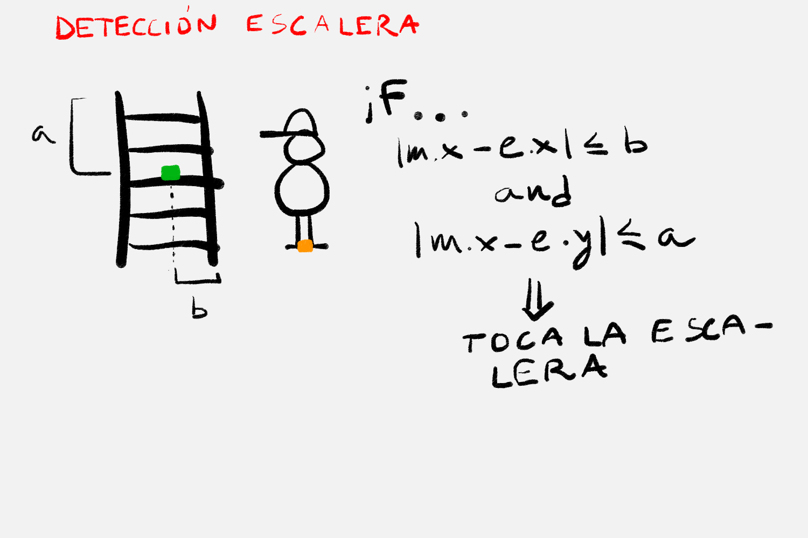

# Proyecto Donkey Kong: Documentación

> Trabajo realizado por Alberto Martínez y Ángel Daniel Pinheiro

## El objetivo del proyecto es crear el juego de Donkey Kong en Python, usando la librería [**pyxel**](https://pypi.org/project/pyxel/) .

# Estructura base del proyecto
Para agilizar el trabajo en conjunto, hemos decidido crear un repositorio privado en Github con el que podamos manejar las diferentes versiones del desarrollo del proyecto.

* El código del juego está contenido en el archivo `main.py`, que se puede ejecutar usando Python3.

* my_resource.pyxres contiene los bancos de imágenes en los que están contenidos todos los sprites del juego.

* README.pdf (este mismo archivo) Documentación de todo el proyecto.

Dado que va a ser un juego, usar un paradigma orientado a objetos es claramente una muy buena elección. Así que lo primero que se ha hecho es crear una estructura de clases a partir de la cual comenzaremos a desarrollar el videojuego.

## Configuración inicial
Justo al principio del script se encuentran ciertas variables globales que especifican aspectos como el tamaño de la pantalla y la tasa de refresco (en fps).
Estas variables facilitan la modificación de estos aspectos de una manera rápida y limpia, permitiendo así cambiar y probar facetas de la interfaz de manera más fácil para el programador.

> Se tenía pensado hacer una clase Config que contuviera estas configuraciones, pero dado que de momento son solo tres variables y no se van a crear múltiples instancias de la configuración, se ha visto innecesario.

# Sprint 1

## Clase Game
Esta clase es la que representa al propio juego de pyxel. Al iniciarse, crea la ventana en la que dicho juego va a suceder.
Repetidamente se actualiza y dibuja los diferentes sprites por pantalla a medida que su posición y características cambian.

## Clase Entity
En el proyecto denominaremos **Entidad** a todo aquello que posea una posición en pantalla, esté representado por un sprite, y posea propiedades físicas básicas. 
Entre los atributos más destacables encontramos:
* **Posición en x e y**: Representan las coordenadas de la entidad en la pantalla
* **Gravedad**: La aceleración de la caída que va a tener el objeto en cuestión.
* **Velocidad en y**: La velocidad en el eje y, muy importante junto a la gravedad para simular la caída del objeto (Y, en el caso de Mario, también el salto)

> Solo para aclarar: No hace falta que el objeto tenga que caer para poder heredar las características de Entity: Por ejemplo, las escaleras y plataformas también son entidades en el juego, solo que con gravedad 0 que impide que caiga o cambie su posición. Ocurre igual con otros objetos estáticos en pantalla.

La clase entidad viene con varios métodos getter y setter que permiten controlar estas propiedades físicas que hemos declarado. Pero hay también un método llamado **init_sprites** que si bien no es declarado en la propia clase Entity, es usado en su método \_\_init\_\_ y es declarado posteriormente en la creación de cada clase que hereda de ésta.

Esto ha sido así dado que consideramos que al tener cada tipo de entidad su propio conjunto de sprites y al no cambiar nunca, es mejor que cada conjunto de sprites sea declarado dentro de la clase del personaje u objeto al que representan. (Añadirlos como atributos del método \_\_init\_\_ de Entity haría el código bastante engorroso)

## Clase Sprite
En pyxel existe un archivo que contiene en 3 bancos de imágenes distintos todos los sprites que se van a usar en el juego. Este archivo es inicializado al iniciar el juego (clase Game).

Dado todo esto, un sprite individual en realidad es un conjunto de aspectos que especifican qué pequeña parte de los bancos de imágenes se va a recortar para escoger cierto sprite.

Así que eso es exactamente lo que representa la clase Sprite. Se compone de:

* **Punto inicial**: El punto en el que se empieza a recortar la imagen.

* **Punto final**: El punto hasta el cual recorta la imagen (formando un rectángulo con el punto inicial)

* **El banco de imagenes**: Cual de los tres bancos de imagenes que ofrece el archivo va a ser el que use a la hora de recortar.

* **El "Chroma key" o color de transparencia**: Si se especifica, establece el color que va a ser sustituido por transparente tras el recorte del sprite.

> Si echas un vistazo a la documentación de pyxel, a la hora de recortar un sprite no coge punto inicial y punto final, sino punto inicial y *distancia de recorte*. Pero no hay que preocuparse, ya que de esto de encarga automáticamente la clase Sprite, creando el atributo *size* que calcula a partir de los puntos especificados. De esta manera, el programador solo tiene que encargarse de poner los dos puntos sin hacer cálculos engorrosos.

## Clases de personajes
Las clases Donkey Kong, Pauline y Mario son entidades que representan a personajes del juego.

No hay necesidad de aclarar ningun aspecto de éstos (salvo de Mario, más adelante), dado que todo lo heredan de la clase Entity. (salvo su conjunto de sprites, lo cual ya se explica en una aclaración anteriormente)

## Clases de objetos
Al igual que los personajes, son entidades del juego solo que al ser estáticas carecen de movimiento. (velocidad y = 0, gravedad = 0)

## Clase Map
Representa al tablero del juego como conjunto, conteniendo todas las entidades tanto estáticas como dinámicas del juego

## Clase "points_text"
Una clase que hemos decidido añadir más adelante durante el desarrollo del juego. Representa a los textos de puntuación que aparecen temporalmente en la pantalla tras saltar Mario sobre un barril.

Posee, además de una posición en x y en y, un contador de frames restantes en los que aparecerá. Cuando el contador llega a cero, el texto desaparece y es borrado más tarde.

# Sprint 2
## Movimiento de Mario
Esta parte del código puede llegar a ser un poco dificil de digerir, luego aquí explicaremos los algoritmos utilizados para hacer que Mario sea controlado por el jugador.

* **Atributo update**: Al ejecutarse, Mario se mueve respondiendo al input del teclado por parte del jugador. Es en este método declarado dentro de la clase Mario en el cual está contenido todo lo que tendrá que ver con el salto, detección de pulsación de teclas... etc.
Este atributo se ejecuta cada frame, dado que es llamado dentro del atributo update del juego en sí.

### Laterales:
Pulsando las teclas izquierda y derecha del teclado, Mario se mueve hacia los lados. Esto se hace de manera muy simple haciendo que detecte las pulsaciones de pyxel.KEY_RIGHT y pyxel.KEY_LEFT, y aumentando o disminuyendo la posición de x en base al input recibido.

### Caída:
Cuando la tecla espacio (pyxel.KEY_SPACE) es pulsada, a Mario se le da una velocidad en y negativa (hacia arriba en la pantalla), para que salte. Gracias a la gravedad de la entidad, poco a poco esta velocidad disminuye y cambia de sentido hacia abajo, haciendo que por sí solo Mario vuelva a caer al suelo completanso así el salto.

> El algoritmo de caída incluye también la detección del fondo inferior de la pantalla, que hace que Mario se detenga cuando llega al suelo.

### Sprites:
Mientras Mario se va moviendo, su sprite es cambiante. Para saber qué sprite se usa en cada momento, ha hecho falta establecer una serie de variables que controlen en estado de Mario:

* **Parámetro jumping**: Su valor es True si mario está saltando, y False si está en el suelo. Permite así cambiar entre el sprite de salto y los de tierra.

* **Variable turn**: Si está en el suelo y se está moviendo lateralmente, su sprite va realizando ciclos de tres posiciones distintas. He aquí el algoritmo que controla qué turno del ciclo está pasando en cierto instante:
    * Primero, se recoge el valor de pyxel.frame_count, que devuelve el número del frame que está sucediendo en ese mismo instante.
    * Tras esto, a este valor se le hace *módulo 30*, convirtiendolo así en un número que va desde el 00 hasta el 29.
    * Todo esto de divide entre 10, haciendo así que se convierta en un decimal que oscila entre 0.0 y 2.9
    * Este decimal se trunca usando la función int() de python, convirtiéndolo en un número que va del 0 al 2.
    * Finalmente se le suma uno, y lo que nos queda es un número que va haciendo ciclos del 1 al 3, cambiando cada 10 fotogramas. Este número es el que más tarde es usado para seleccionar el sprite correspondiente: 'right**1**, right**2**, left**1**, left**2**.. etc.'

    > Este proceso se podría simplificar haciendo simplemente módulo 3 del frame_count, pero esto da lugar a un ciclo que cambia cada frame, lo cual yendo a 60 fps o incluso 30 fps es demasiado rápido y antiestético. Con este otro algoritmo, este ciclo cambia de manera 10 veces más lenta.

    > Este algoritmo es usado posteriormente en varias entidades que poseen un ciclo de rotación de sprites. (Como los barriles)

> ## Posición teórica
> Pese a que mario es para los ojos del jugador un personaje de cierto tamaño, a la hora de establecer sus propiedades físicas su posición queda registrada como un único punto en el mapa (x, y). 
Pues bien, pese a que no se ve, ese punto está localizado (para facilitar cosas como la deección del suelo) en los PIES de mario. Esto será de gran utilidad en el siguiente apartado, en la interacción con las plataformas.

## Interacción de Mario con el entorno básico (plataformas y escaleras)

### Plataformas
Las plataformas son un elemento de pantalla que actúan como *suelo* para nuestro personaje. Y al igual que no se cae del fondo de la pantalla de juego, tampoco puede atravesar una plataforma al caer.

Parte de la implementación ya está en realidad hecha: Al poseer una gravedad, Mario va a caer hacia el suelo siempre que no haya ningún obstáculo que se lo impida. Lo único que hay que hacer es que reconozca las plataformas como un obstáculo.

Pero antes de esto, establecemos un modelo de plataforma con el que podamos trabajar adecuadamente, partiendo de la clase que ya habíamos hecho al principio del proyecto.

Dado que la posición "teórica" de mario está literalmente en sus pies, hemos visto bastante conveniente establecer la posición teórica de la plataforma justo al contrario, en el centro superior de su sprite.
De este modo, podemos saber que Mario está a la altura de la plataforma cuando la posición de los pies esté justo encima que la posición de la plataforma en el eje Y.
Del mismo modo pero en el eje x, podemos detectar cuando mario está justo encima de la plataforma. Si la distancia en el eje x de los pies de Mario respecto a la coordenada en x de la plataforma no supera el ancho de ésta, sabemos que mario está sobre ella.

He aquí una explicación gráfica que seguro que es más aclaratoria:

> **TOLERANCIA**: Dado que a veces la altura de plataformas contiguas entre sí dista un pixel de distancia, se establece una tolerancia de 2 píxeles en el eje y para que mario pueda caminar sobre ellas detectándolas sin ningún problema.

> Una vez detecta una plataforma en su caída, el protocolo que sigue Mario es idéntico al que sigue cuando detecta el fondo de la pantalla: Su velocidad en el eje Y pasa a ser 0 (se para), su posición en el eje Y se queda justo por encima del "suelo" (en este caso plataforma), y las variables que controlan aspectos como el salto indican que Mario ha llegado a un suelo y que por lo tanto ha dejado de saltar.

### Escaleras
Las escaleras, junto a las plataformas, constituyen el escenario básico con el cual Mario interactúa.

Al subir Mario a una escalera, varias cosas cambian: Deja de afectarle la gravedad y pasa de poder desplazarse lateralmente a poder hacerlo solo arriba o abajo.

Así que eso es lo que se implementa.
Se añade dos movimientos más al update de Mario: Moverse arriba (tecla UP) y moverse abajo (tecla DOWN).

Pero todo esto con ciertas condiciones...
Si Mario está solo tocando una escalera podrá solo moverse hacia arriba o hacia abajo. Si además está tocando una plataforma también puede moverse hacia los lados (para poder salir de la escalera). Si está tocando solamente plataformas, nada cambia. 

Es evidente que para controlar este nuevo abanico de condiciones hacía falta crear nuevos parámetros de Mario:

* **Parámetro stair**: Vale True cuando Mario está tocando una escalera y False cuando no.
* **Parámetro plataforma**: Vale True cuando Mario toca una pataforma y False cuando no.

De este modo, con varias conficiones if-else, somos capaces de cambiar el comportamiento y el movimiento de Mario en base a su interacción con el escenario básico del juego.

La detección de la escalera por parte de Mario sigue el siguiente concepto:

Como se puede ver, la forma de detectarla no dista mucho de la plataforma. Pasará igual con la detección del barril.

Además de esto, se han ido añadiendo más condiciones a la detección con el fin de optimizarla y solucionar errores que iban surgiendo.
Por ejemplo, a ese condicional se le añadiría que Mario *No estuviese saltando*, para que así no pueda subir a la escalera mientras salta.

> Tras haber optimizado las físicas de Mario y los elementos básicos del juego, hicimos el mapa del nivel. Al probar a Mario en el mapa ya completado, surgieron varios errores que tuvimos que mitigar antes de seguir con el desarrollo.

# Sprint 3
## Barriles
Una vez listo el movimiento de Mario con el entorno, los barriles son el centro de atención.

Un barril:

* Cae al igual que Mario, aunque con una gravedad menor.
* Detecta plataformas y se posa sobre ellas, al igual que Mario.
* Aunque el movimiento del barril no es controlado por el jugador. Comienza yendo hacia la derecha y al bajar de plataforma ya sea por las escaleras o por el borde de éstas su dirección cambia de sentido.

### Plataformas
La detección de plataformas funciona en los barriles de manera no muy distinta a como funciona con Mario, no hace falta ninguna aclaración en este apartado.

### Escaleras
De una manera parecida a Mario, el barril es capaz de detectar la escalera; Con la única diferencia de que el barril solo necesita detectar el *inicio* de una escalera (Arriba del todo).

Tras detectar el inicio de una escalera, entra en juego la probabilidad:
El barril debe tener 1/4 de probabilidades de caer por una escalera. Una fácil implementación debería ser importar la librería random para hacer que haya 1/4 de posibilidades de bajar: `random.randint(1, 4) == 4 # Esto devolvería True solo un cuarto de las veces`.
  Pero hay algo que no tuvimos en cuenta al principio. Un barril tarda **varios frames** en pasar por el inicio de una escalera. (una media de 5 frames, tal y como comprobamos haciendo que imprimiese por pantalla texto cada vez que detectaba una escalera). 
Esto significa que haría la comprobación estadística 5 veces seguidas, dando lugar a una probabilidad errónea (mucha más probabilidad de caer por la escalera de la que debería).

Para comprender esto, es necesario ver la situación al contrario: Si cada vez que hace la comprobación tiene un 3/4 de probabilidades de seguir sin bajar, haciendo la comprobación 5 veces esa probabilidad baja reásticamente: (3/4)^5 = 0.24% de probabilidad de seguir, luego tiene más del 70% de probabilidad de caer por la escalera.

Para arreglar esto, hay que usar un caso cuya probabilidad elevado a la quinta de un 75%, y usar su contrario para hacer que baje la escalera (haciendo así que de verdad tenga un 25% de probabilidad de caer por la escalera, 1/4)
La raíz quinta de 0.75 es 0.94, un 94/100. Su contrario es 6/100, luego la implementación correcta con la librería random es `random.randint(1, 100) <= 6`. Dentro de un if con esa condición es donde se le da la orden al barril para que baje, haciendo que solo baje alrededor de 1/4 de las veces.

Una vez solucionado el problema de probabilidad hacer que baje el barril es sencillo. Simplemente se le mueve hacia abajo un par de píxeles de golpe. Esto hace que salga del rango de tolerancia de la plataforma y el resto se hace solo: El barril cae por la escalera gracias a la gravedad, y una vez llega abajo continúa su camino.
> Al igual que Mario, el barril tiene un rango de tolerancia a la hora de detectar la altura de la plataforma. Si no bajase varios píxeles de golpe, seguiría detectando la plataforma y se quedaría sobre ella sin bajar.

### Dirección y sprites
Tras hacer todo lo anterior, solo falta animar el sprite del barril.

El ciclo de sprites usa el famoso algoritmo que usa también Mario a la hora de elegir qué sprite usar: `int(pyxel.frame_count%40/10) + 1` devuelve un numero del 1 al 4, cuando cambia por los sprites en los que rueda lateralmente. Cuando cae, en cambio, oscila entre dos sprites de caída, pero el algoritmo básicamente es el mismo: `int(pyxel.frame_count%20/10) + 1`.

Tras esto, solo hace falta hacer que varíe de dirección. Esto lo hace cada vez que toca el borde lateral de la pantalla (se cae por el lado de la plataforma) o cada vez que toca una plataforma tras caer por una escalera. Siempre que baja un nivel cambia de sentido de derecha a izquierda o viceversa.

* **Parámetro heading_right**: Devuelve un booleano dependiendo de si el barril tiene que avanzar hacia la derecha o no (a la izquierda)

* **Parámetro cayendo**: Si está cayendo por una escalera, este parámetro vale True. (sirve para cambiar tanto de sprite como de dirección)